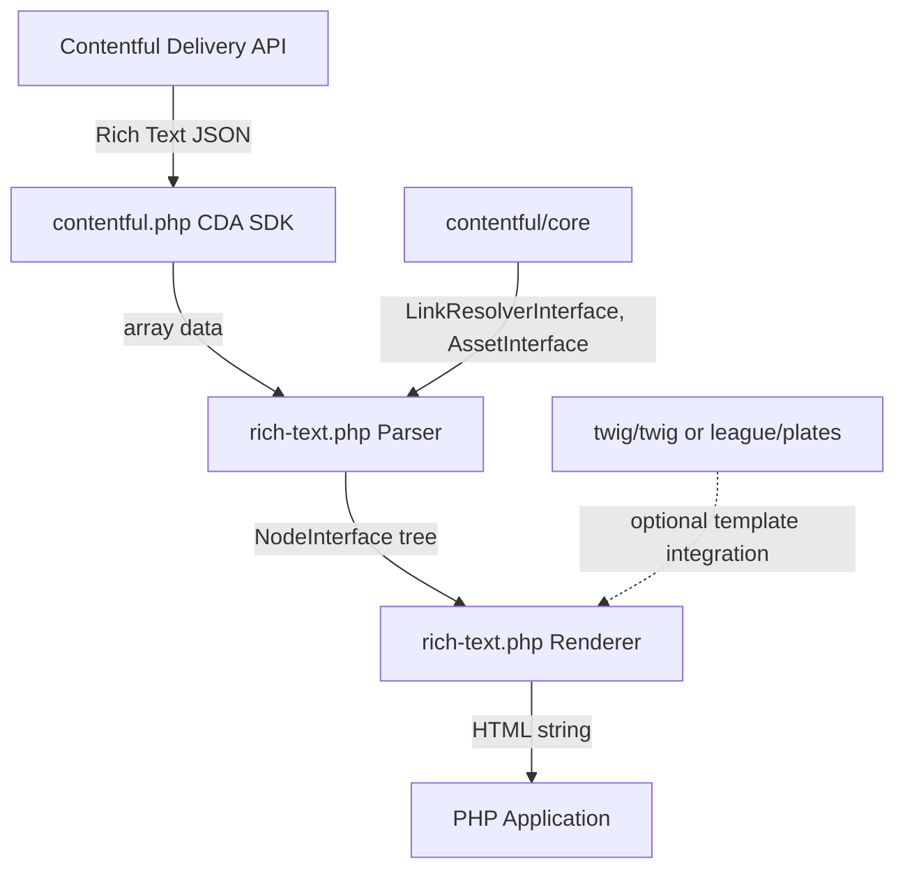

# Architecture

<!-- Generated by seed-golden-context | Last updated: 2026-05-11 -->

## Overview

`rich-text.php` is a PHP library for parsing and rendering Contentful Rich Text field data. It converts the Rich Text JSON format (a recursive tree of typed nodes) into PHP object trees via a `Parser`, and renders those trees to HTML strings via a `Renderer`. The library is publish-and-forget: it is released to Packagist and consumed by downstream PHP Delivery SDK integrations, not operated as a service.

## System Context



The library is consumed primarily by `contentful/contentful.php` (the PHP CDA SDK) and directly by PHP applications rendering Rich Text fields. It depends on `contentful/core` for the `LinkResolverInterface` used during embedded entry/asset resolution, and optionally integrates with Twig and Plates templating engines via Bridge classes.

## Internal Structure

| Directory/Package | Purpose |
|---|---|
| `src/Node/` | PHP objects representing every Rich Text node type (Document, Paragraph, Heading1–6, Table/Row/Cell, etc.). All implement `NodeInterface`. |
| `src/NodeMapper/` | Maps raw JSON array data for a given node type into the corresponding `Node` object. One mapper per node type. |
| `src/NodeMapper/Reference/` | Helper classes for resolving embedded entry/asset links during parsing (`EntryReference`, `StaticEntryReference`). |
| `src/NodeRenderer/` | Renders a specific `Node` type to an HTML string. One renderer per node type. Custom renderers implement `NodeRendererInterface`. |
| `src/Mark/` | PHP objects for inline text marks (Bold, Italic, Code, Underline, Strikethrough, Superscript, Subscript). |
| `src/Bridge/` | Optional integrations with Twig (`TwigExtension`) and Plates (`PlatesExtension`) templating engines. |
| `src/Parser.php` | Core parser: holds a map of `nodeType → NodeMapper`, delegates to the correct mapper, passes a `LinkResolverInterface` for link resolution. |
| `src/ParserInterface.php` | Public interface for the parser. Defines `parseLocalized()` as the canonical entry point; `parse()` and `parseCollection()` are deprecated. |
| `src/Renderer.php` | Core renderer: holds a stack of `NodeRenderer` instances (highest-priority first), delegates each `Node` to the first `NodeRenderer` that supports it. |
| `src/RendererInterface.php` | Public interface for the renderer. Exposes `render()` and `renderCollection()`. |
| `tests/Unit/` | Unit tests per node/mapper/renderer class. |
| `tests/Integration/` | End-to-end integration tests including Twig and Plates rendering. |
| `tests/Fixtures/` | JSON fixture files used by integration tests. |
| `tests/Implementation/` | Test implementations of custom node renderers (Twig, Plates) for integration test use. |
| `scripts/` | Release tooling and doc generation helpers (`release.php`, `prepare-docs.sh`, `create-redirector.php`). |

## Data Flow

```
Raw Rich Text JSON (array)
    → Parser::parseLocalized($data, $locale)
        → looks up nodeType in $mappers map
        → NodeMapper::map($parser, $linkResolver, $data, $locale)
            → recursively calls $parser->parseLocalized() for child nodes
            → calls $linkResolver->resolveLink() for embedded entries/assets
        → returns NodeInterface object tree
    → Renderer::render($node, $context)
        → iterates $nodeRenderers stack (highest priority first)
        → first NodeRenderer::supports($node) == true wins
        → NodeRenderer::render($renderer, $node, $context)
            → calls $renderer->renderCollection($node->getContent()) for children
        → returns HTML string
```

**Key invariant:** The renderer stack is a priority queue — `pushNodeRenderer()` prepends (highest priority), `appendNodeRenderer()` appends (lowest priority). Custom renderers override defaults by being pushed first. The `CatchAll` renderer must always be appended, never pushed, or it will shadow all other renderers.

## Key Dependencies

| Dependency | Why it's here |
|---|---|
| `contentful/core` ^3.0\|^4.0 | Provides `LinkResolverInterface`, `AssetInterface`, `ImageFile`, and shared test scaffolding. Mandatory — the parser cannot resolve embedded entries without it. |
| `phpunit/phpunit` ^8.5 | Test framework (dev only). |
| `twig/twig` ^3.0 | Optional Twig templating integration (dev + suggested). |
| `league/plates` ^3.3 | Optional Plates templating integration (dev + suggested). |
| `phpstan/phpstan` ^1.9 | Static analysis at level 5 (dev only). |
| `roave/backward-compatibility-check` ^7.1\|^8.2.1 | Automated BC break detection on CI (dev only). |
| `friendsofphp/php-cs-fixer` | Syntax/style linting on CI (installed separately, not in composer.json). |

## Configuration

This library has no runtime configuration flags or environment variables. All customization is achieved by constructing custom `NodeMapper` and `NodeRenderer` instances at the application level.

| Extension Point | How to use |
|---|---|
| Custom `NodeMapper` | Call `$parser->setNodeMapper($nodeType, $mapper)` to override or add a mapper for a node type. |
| Custom `NodeRenderer` | Call `$renderer->pushNodeRenderer($renderer)` to add high-priority renderer; `appendNodeRenderer()` for low-priority (catch-all). |
| `EmbeddedImage` renderer | Call `$renderer->enableEmbeddedImageRenderer(true)` to activate the built-in `` tag renderer for embedded image assets. Disabled by default to preserve backward compatibility. |
| Twig integration | Register `TwigExtension` on the Twig environment; exposes `rich_text_render()` and `rich_text_render_collection()` in templates. |
| Plates integration | Load `PlatesExtension`; exposes `$this->richTextRender()` and `$this->richTextRenderCollection()` in templates. |

## Integration Points

### Upstream (this repo consumes)

- `contentful/core` — `LinkResolverInterface` for resolving embedded entries/assets during parsing; `AssetInterface` and `ImageFile` for the `EmbeddedImage` renderer.
- Contentful Rich Text JSON schema — the input format this library parses. Schema is defined by Contentful's platform; library must track it as new node types are added (see ADR-002).

### Downstream (consumes this repo)

- `contentful/contentful.php` (PHP CDA SDK) — primary consumer; integrates the parser into the SDK's entry deserialization pipeline.
- PHP applications — direct consumers via Composer (`contentful/rich-text`).
- Contentful PHP documentation — the official ["Using Rich Text in the PHP Delivery client library"](https://www.contentful.com/developers/docs/php/tutorials/using-rich-text-in-the-php-cda-sdk/) tutorial references this library directly.
